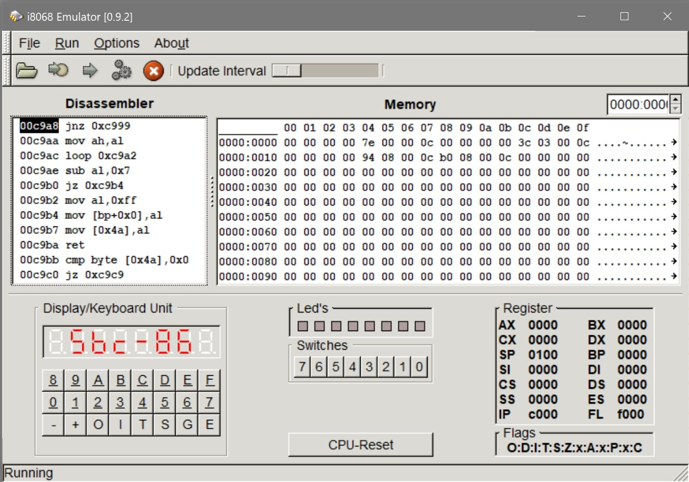

# ba-assambly-course

HSMW Assambly Course from the University of Applied Science Mittweida in the subject
computer architecture that took place in 2018.

> **_NOTE:_** The commentary appears in German.

## Picture

## Used Software

[i8086 Emulator](http://sourceforge.net/projects/i8086emu/)

A multi-platform i8086 Emulator (SBC-86)
© 2004 Joerg Mueller-Hipper, Robert Dinse,
Fred Brodmueller, Christian Steineck
